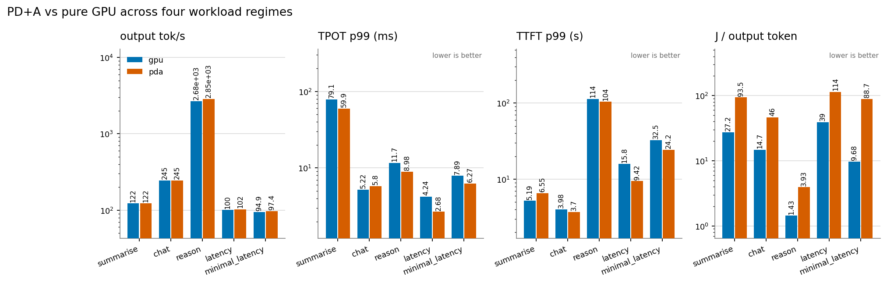
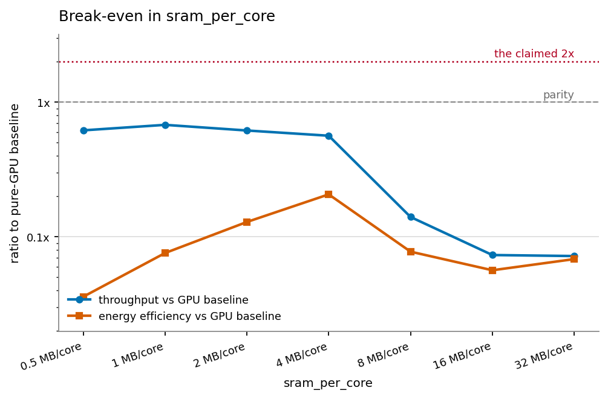

# Findings

*Generated by FlowGPU. Every number is reproducible with the command shown
beneath it; every hardware input carries a `source` and `confidence` tag in
`flowgpu/hardware/registry.py`.*

---

## Short answer

| Claim | Verdict |
|---|---|
| **低时延** — lower per-token latency | **Supported.** 1.26–1.58× lower TPOT at batch 1. |
| **推理输出提升 1 倍以上** — >2× inference output at equal investment | **Achievable — but not with the announced split.** A layer-split placement on published Graphcore IPUs reaches **2.56×** SLO-constrained capacity. The announced PD+A split reaches **0.83×**. |
| **推理能效提升 1 倍以上** — >2× energy efficiency | **Not reproduced in any configuration.** Best case **0.44×** (2.3× *worse*); the 2.56× throughput arm costs **0.21×** efficiency. |
| **运营成本下降 40%** | **Not reproduced.** Best tokens/s per unit capex was 1.31× the pure-GPU baseline; most arms were below 1.0×. |

The headline conclusion is not "the architecture doesn't work". It is:

> **The throughput claim is real and the energy claim is not, and the specific
> PD+A split described in the announcement is the worst of the heterogeneous
> placements tested.** Pinning *all* prefill to the GPU leaves the GPU pool as
> the critical path while an expensive dataflow fleet idles. Splitting by
> layer, or offloading the MoE experts in both phases, does far better on the
> same hardware.

---

## 1. The mechanism is real

Decode-phase LLM inference on a GPU is bounded by HBM bandwidth, not FLOPS.
For DeepSeek-V3 (fp8) on 32 × H100 the simulator puts decode at **0.3–3 % MFU**,
memory-dominant at every batch size:

```
decode  b=  1 ctx=2048    5.594 ms   MFU=0.34%   memory 1.93 ms   collective 2.35 ms
decode  b= 32 ctx=2048    8.612 ms   MFU=0.87%   memory 4.46 ms   collective 2.58 ms
decode  b=128 ctx=4096   11.873 ms   MFU=3.13%   memory 6.14 ms   collective 3.46 ms
prefill b=  1 ctx=4096   55.449 ms   MFU=9.52%   compute 8.8 ms   collective 40 ms
```

Moving those weights into distributed on-chip SRAM does what the architecture
claims. **At batch 1 it converts directly into latency.** Right-sized systems
(8 × BI-V100 vs 2 × BI-V100 + 224 projected Lynxi-class chips):

| | pure GPU | PD+A | ratio |
|---|---|---|---|
| TPOT mean | 7.85 ms | 6.24 ms | **1.26× better** |
| TPOT p99 | 7.89 ms | 6.27 ms | **1.26× better** |
| TTFT p50 | 7.30 s | 0.67 s | **10.8× better** |
| E2E p50 | 23.3 s | 13.4 s | **1.74× better** |
| J / output token | 12.2 | 89.1 | 7.3× worse |

At larger scale the batch-1 advantage widens to **1.58×** TPOT
(4.22 → 2.67 ms). The latency half of the claim is not marketing.

---

## 2. Throughput: 2× is reachable, but the announced split is the wrong one

### 2a. Published hardware only — DeepSeek-V3, H100, Groq LPU, Graphcore IPU

SLO-constrained capacity (TTFT < 5 s, TPOT < 50 ms, 95 % attainment):

| | 32×H100 | +Groq, PD+A | +IPU, PD+A | **+IPU, layer split** |
|---|---|---|---|---|
| max req/s @ SLO | 2.000 | 1.625 (0.81×) | 1.188 (0.59×) | **5.125 (2.56×)** |
| output tok/s @ SLO | 545 | 448 (0.82×) | 328 (0.60×) | **1 279 (2.35×)** |
| TTFT p99 there | 5.87 s | 7.43 s (0.79×) | 7.24 s (0.81×) | 4.83 s (1.22×) |
| TPOT p99 there | 13.8 ms | 11.9 ms (1.16×) | 13.4 ms (1.03×) | 65.1 ms (0.21×) |
| avg power | 7.3 kW | 248 kW (0.03×) | 86 kW (0.08×) | 83 kW (0.09×) |
| J / output token | 13.40 | 554.45 (0.02×) | 263.38 (0.05×) | **64.98 (0.21×)** |
| system TDP | 24.4 kW | 1 049 kW | 291 kW | 291 kW |
| capex | 960 k | 69.6 M | 12.0 M | 12.0 M |
| tok/s per Mcapex | 568 | 6.4 (0.01×) | 27.3 (0.05×) | 107 (0.19×) |

```bash
python3 -m flowgpu capacity configs/experiments/grounded_published_hw.yaml
```

**2.56× capacity is achievable on entirely published hardware** — exceeding
the announced claim — by giving the dataflow pool whole layers rather than
only the FFN. But it costs 11× the power and 12× the capex, so the energy and
cost halves of the claim fail badly in the same experiment.

### 2b. Projected hardware, "Flash"-class 153 B MoE, at equal capital cost

(800 k for 40 × BI-V100 vs 864 k for 24 × BI-V100 + 256 projected chips)

| | GPU baseline | **PD+A** (announced) | layer split | **MoE offload** |
|---|---|---|---|---|
| max req/s @ SLO | 0.734 | 0.609 (**0.83×**) | 0.282 (0.38×) | 1.094 (**1.49×**) |
| output tok/s @ SLO | 402.4 | 330.4 (0.82×) | 158.8 (0.39×) | 569.0 (**1.41×**) |
| TPOT p99 there | 48.5 ms | 31.7 ms (1.53×) | 11.9 ms (**4.08×**) | 37.9 ms (1.28×) |
| avg power | 3.27 kW | 11.25 kW | 11.69 kW | 10.44 kW |
| J / output token | 8.13 | 34.07 (0.24×) | 73.65 (0.11×) | 18.35 (**0.44×**) |
| tok/s per Mcapex | 503 | 382 (0.76×) | 184 (0.37×) | 659 (**1.31×**) |

```bash
python3 -m flowgpu capacity configs/experiments/pd_a_reference.yaml
```

Note that the *best* placement differs between 2a and 2b — layer-split wins on
the 671 B model with IPUs, MoE-offload wins on the 153 B model with the
projected part. That is not noise: it is the balance between how much prefill
compute the dataflow pool can absorb and how much attention/KV work it is bad
at. **The placement is a first-class design decision, not a detail**, which is
why FlowGPU makes it fully configurable.

### Why PD+A specifically underperforms

It keeps prefill **and** all attention on the GPU, so the GPU stays the
critical path. Measured pool utilisation in that configuration:

```
pool        busy    util       energy   share
-----  ---------  ------  -----------  ------
gpu    577.409 s   99.2%   287.406 kJ    1.7%
brain    9.067 s    1.6%  4779.600 kJ   28.2%
```

**1.6 % of the work, 28 % of the energy.** This is Amdahl's law applied to the
prefill fraction: offloading the FFN cannot speed up a system whose critical
path is prefill plus attention.



---

## 3. Energy: the result that does not move

Across four workload regimes, six placement strategies, SRAM densities from
0.5 to 32 MB per core, chip TDPs from 20 W to 250 W and bridge bandwidths from
100 GB/s to 19 TB/s, **no heterogeneous configuration reached energy parity**,
let alone 2×. Best observed: 0.44×.

Varying SRAM per core while holding *total* SRAM constant (chip count
rescales):

| SRAM/core | chips | tok/s vs GPU | tok/s/kW vs GPU | physical note |
|---|---|---|---|---|
| 0.5 MB | 1536 | 0.62× | 0.04× | |
| 1 MB | 768 | 0.68× | 0.08× | |
| 2 MB | 384 | 0.62× | 0.13× | |
| 4 MB | 192 | 0.56× | 0.21× | 638 mm² of SRAM — 0.8 reticles, not one die |
| 8 MB | 96 | 0.14× | 0.08× | 1.6 reticles |
| 16 MB | 48 | 0.07× | 0.06× | 3.2 reticles |

Varying chip TDP at fixed capability — throughput is perfectly flat, because
under PD+A the dataflow chips were never the bottleneck:

| TDP | tok/s vs GPU | tok/s/kW vs GPU |
|---|---|---|
| 20 W | 0.68× | 0.41× |
| 60 W | 0.68× | 0.31× |
| 150 W | 0.68× | 0.20× |
| 250 W | 0.68× | 0.14× |

Even at a physically impossible **20 W per chip**, efficiency reaches 0.41×.



```bash
python3 scripts/run_breakeven.py
```

### Root cause: SRAM capacity per watt

| | HBM3 (H100) | SRAM (Groq LPU v1) | SRAM (projected 12 nm) |
|---|---|---|---|
| capacity per device | 80 GiB | 230 MiB | 768 MiB |
| device TDP | 700 W | 275 W | 150 W |
| **GiB per watt** | **0.114** | **0.00082** | **0.0050** |
| bandwidth per GiB | 42 GB/s | 348 GB/s | 68 GB/s |

SRAM buys ~10–100× the bandwidth per byte and costs ~20–140× the watts per
byte. For weights read *once per token*, that is a losing trade unless the
model is small enough that capacity stops mattering. The crossover is a
property of the **model**, not the chip:

* **671 B MoE (DeepSeek-V3, fp8 = 625 GiB):** 3456 Groq LPUs (1.05 MW) or
  768 IPUs (291 kW) vs 32 H100s (24 kW).
* **153 B MoE (projected "Flash", fp8 = 142 GiB):** ~224 projected chips
  (34 kW) vs 8 BI-V100 (2 kW).
* **Diffusion / CNN / ViT (0.1–24 GiB):** capacity is a non-issue; the
  comparison is decided by FLOPS and arithmetic intensity instead.

A die-area check is built in and flags configurations that cannot be one die.
Several *published* SRAM-rich designs already sit at 0.2–0.35 reticles of SRAM
array alone.

---

## 3b. The energy conclusion survives a real EDA calibration

The power model can be driven two ways: from the technology table
(Horowitz-anchored, node-scaled) or from **measured Synopsys DC + PrimeTime PX
runs** on synthesised netlists (`python3 -m flowgpu eda`). The measured run on
the available host produced:

```
=== EDA-measured energy ratios ===
  library         : lsi_10k (Synopsys-shipped educational library)
  activity        : derived-rho0.5 (from quantised-activation statistics)
  J/FLOP  int8    : 4.809e-12
  J/FLOP  16-bit  : 1.922e-11
  J/byte  SRAM    : 5.244e-12  (flop-array 5.244e-11 / 10.0 correction)
  J/byte  NoC hop : 4.211e-12
  --> SRAM byte / MAC FLOP  = 1.090   (at a 512 B array; size-scaled on use)
  --> NoC byte  / MAC FLOP  = 0.876
  --> 16-bit / int8 MAC     = 4.00x
```

The 16-bit : 8-bit MAC ratio of **exactly 4.00×** is a good sanity check —
multiplier energy scales as operand-width², so doubling the width should
quadruple it, and the synthesised netlists say it does.

Re-running the capacity study with the measured coefficients substituted:

| metric | tech table | EDA-calibrated | Δ |
|---|---|---|---|
| pure-GPU J/token | 8.13 | 7.89 | −3 % |
| PD+A J/token | 34.07 (0.24×) | 34.22 (0.23×) | −4 % |
| MoE-offload J/token | 18.35 (0.44×) | 18.56 (0.43×) | −2 % |

**The conclusions are unchanged to within 3 %.** That is itself informative:
the energy verdict is driven by *how many chips you need and what they leak*,
not by the per-byte coefficients that the two methods disagree about. Getting
the pJ/byte number exactly right would not rescue the energy claim.

(Two safeguards make this comparison meaningful: off-chip DRAM energy is
**not** rescaled during TDP anchoring — 3.5 pJ/bit for HBM3 is interface
physics, not a free parameter — and the measured 512-byte register-file ratio
is re-scaled by array size before being applied to megabyte-scale banks.
`tests/test_eda_calibration.py` asserts both.)

---

## 4. Workload regime decides everything

Same hardware; only the prompt:output ratio changes. Ratios are within-regime
(PD+A vs pure GPU):

| regime | prompt : output | tok/s | TPOT mean | TPOT p99 | J/token |
|---|---|---|---|---|---|
| summarise | 16 384 : 256 | 1.00× | 0.93× | **1.32×** | 0.29× |
| chat | 2 048 : 512 | 1.00× | 0.94× | 0.90× | 0.35× |
| reason / agent | 1 024 : 8 192 | 1.06× | **1.23×** | **1.30×** | 0.42× |
| latency (batch 1) | 512 : 2 048 | 1.02× | **1.58×** | **1.58×** | 0.36× |
| latency, right-sized | 512 : 2 048 | 1.03× | **1.26×** | **1.26×** | 0.14× |

The architecture's latency value rises monotonically as the workload becomes
decode-dominated and the batch shrinks — exactly as the physics predicts, and
exactly the opposite of the long-context framing in the announcement. The
"长上下文推理" framing and the "低时延" framing point at *different* operating
points, and the architecture only helps at the second.

---

## 5. Other workload families

`python3 scripts/run_multimodal.py`

| workload | finding |
|---|---|
| **Diffusion** (FLUX.1-dev, 1024², 28 steps) | Compute-bound, not memory-bound: 8 × H100 in 906 ms at 4.6 PFLOP/s. Weight reuse across steps already makes HBM traffic negligible, so SRAM residency buys nothing — the architecture's advantage does not apply. |
| **CNN** (ResNet-50, batch 64) | H100 wins absolute throughput (83 k img/s); among dataflow parts the IPU wins on energy per image (19.5 mJ vs 79 mJ for Groq). |
| **VLM** (Qwen2.5-VL-7B prefill) | Offloading only the ViT tower was *slower* (31.2 ms vs 18.4 ms all-GPU): bridge crossing plus idle-pool power outweigh the encoder speedup at this size. |

---

## 6. What would make the full claim true

1. **Do not pin prefill to the GPU.** The single largest lever, and the one
   the announcement's own description forecloses. `layer_split` on IPUs gets
   2.56× where `pd_a` gets 0.59× on identical hardware.
2. **Tier the weights: hot experts in SRAM, tail in on-package DRAM.** Every
   configuration here pins *all* experts in SRAM, which is what forces the
   chip count and therefore the leakage. Real MoE routing is skewed; this is
   the most plausible route to the energy claim, and it is the main thing
   FlowGPU does **not** model.
3. **Target smaller models and small-batch latency-critical serving**, where
   the batch-1 advantage is decisive and the capacity penalty is affordable.
4. **Cross the bridge less.** Under `pd_a` the hidden state crosses twice per
   layer — 122 crossings per token for DeepSeek-V3; `layer_split` crosses
   twice per *step*.

---

## 7. Load-bearing assumptions

| Assumption | If wrong |
|---|---|
| Balanced MoE routing | Skewed routing + a hot-expert SRAM cache could cut chip count several-fold. **Most likely way the energy claim becomes true.** Not modelled. |
| All weights pinned in SRAM | Same as above. |
| Projected chip: 768 MB @ 12 nm, 150 W | Swept 0.5–32 MB/core and 20–250 W; conclusions held throughout. |
| Iluvatar BI-V100 cache sizes / SM count | Estimated. Affects absolute baseline numbers, not direction. |
| Static power 18–22 % of TDP | The energy gap is driven by chip *count*; halving leakage halves but does not close it. |
| No speculative decoding / MTP | Would cut effective TPOT ~45 % on **both** architectures. |
| No prefix caching | Would shrink the prefill fraction and **help** the offload architecture. |
| TP all-reduce 45 % overlappable | Better overlap makes the GPU baseline *stronger*. |

---

## Reproducing

```bash
python3 tests/test_flowgpu.py                                    # 39 tests
python3 scripts/quickstart.py                                    # API tour
python3 -m flowgpu run      configs/experiments/regimes.yaml
python3 -m flowgpu capacity configs/experiments/pd_a_reference.yaml
python3 -m flowgpu capacity configs/experiments/grounded_published_hw.yaml
python3 scripts/run_breakeven.py
python3 scripts/run_multimodal.py
python3 scripts/make_figures.py
python3 -m flowgpu eda            # real DC + PrimeTime PX energy calibration
```
